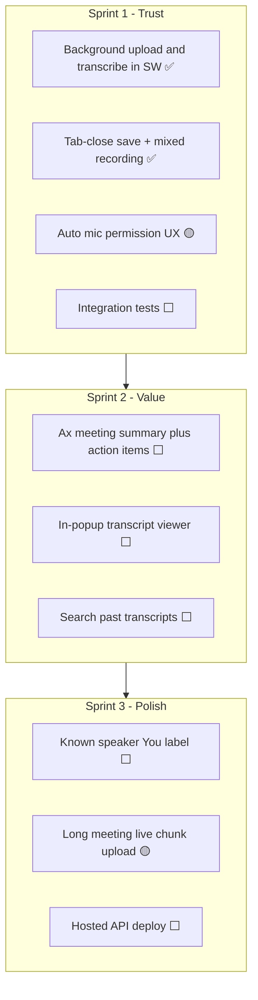

# Cognium Meet — Roadmap

You have a working core loop: record a browser tab (+ optional mic mixed into one file) → transcribe via **gpt-4o-transcribe-diarize** → download timestamped TXT/JSON with **Speaker 1 / 2 / …** labels. This document outlines practical next steps, ordered by impact.

**Legend:** ✅ Done · 🟡 Partial · ⬜ Not started

## Shipped (not originally on roadmap)

| Status | Item |
|--------|------|
| ✅ | **Record any `http`/`https` tab** (not only Google Meet) |
| ✅ | **Microphone device picker** in Settings (`deviceId` binding; Chrome ≠ OS default) |
| ✅ | **Inline Settings in popup** — API URL, token (show/hide), mic device; shared with options page |
| ✅ | **Mixed recording** — tab + mic in one WebM; mic still plays through speakers |
| ✅ | **Speaker diarization** — `gpt-4o-transcribe-diarize` with `diarized_json` (override with `TRANSCRIPTION_MODEL=whisper-1`) |
| ✅ | **Multipart upload** (no base64 bloat) + **150 MB** API body limit |
| ✅ | **Audio prep**: compress to MP3 + **chunk long audio** before API upload (25 MB limit) |
| ✅ | **IndexedDB local backup** before upload; **Retry upload** on failure |
| ✅ | **Stop recording** without transcribe (save locally; transcribe later) |
| ✅ | **Delete local** (IndexedDB) and **Delete on server** (`DELETE /v1/recordings/:id`) |
| ✅ | **API request logging** + transcription lifecycle logs |
| ✅ | **Retry transcription** endpoint + OpenAI connection retries |
| ✅ | **Recording state** survives popup close / service worker restart |
| ✅ | **Tab-close save** — flush to IndexedDB on capture end; `OFFSCREEN_FLUSH` + race fixes |
| ~~✅~~ | ~~**Consent banner** on recorded tabs~~ — removed (recording status shown in popup only) |

---

## Tier 1 — Reliability & daily usability (do these first)

These address pain already hit during testing.

| Status | Item | Why |
|--------|------|-----|
| ✅ | **Background transcription** | Upload + poll run in the service worker; safe to close the popup while transcribing. |
| 🟡 | **Auto mic prompt on first record** | Mic grant + device picker live in **Settings**; popup warns when mic is missing. No in-popup CTA before first record yet. |
| ✅ | **Recording survives tab close** | On tab close or capture end, offscreen flushes mixed audio to IndexedDB and finalizes. |
| 🟡 | **Long meeting support (>30 min)** | Multipart upload, MP3 compression, ffmpeg chunking for >25 MB, and higher body limit are in. No live chunked upload *during* recording yet. |
| 🟡 | **Dev ergonomics** | `pnpm dev` / `dev:api` / `dev:extension`, `/health` endpoint, README notes on stale `:3847` and inotify. No `/version` or `dev:api:restart` script yet. |
| ⬜ | **Integration tests** | API upload → ffmpeg → diarize (mocked) + extension audio-bytes round-trip. *(Only `packages/shared` has unit tests today.)* |

## Tier 2 — Otter/Fellow basics (biggest product jump)

| Status | Item | Why |
|--------|------|-----|
| ⬜ | **AI meeting notes** | Post-process `transcript.json` with `@ax-llm/ax`: summary, action items, decisions, open questions. |
| 🟡 | **Speaker labels** | **Speaker 1 / 2 / …** via diarization on mixed audio. No Meet display names without caption scrape or known-speaker references. |
| ⬜ | **In-popup transcript viewer** | Today you only download TXT/JSON. Show transcript inline with search and copy. |
| ⬜ | **Search across past meetings** | Index transcripts in SQLite or the API. |

## Tier 3 — Smarter capture

| Status | Item | Why |
|--------|------|-----|
| ⬜ | **Real-time captions** | Stream chunks to a live STT API; show captions in a sidebar or panel. |
| ⬜ | **Known speaker references** | Pass a short mic clip to diarize API so one speaker can be labeled **You**. |
| ⬜ | **Meet display names without a bot** | Scrape live captions UI or use Google Workspace recording — fragile. |
| ⬜ | **Language detection + translation** | Optional translate-to-English (or target language) in the API. |

## Tier 4 — Platform & scale

| Status | Item | Why |
|--------|------|-----|
| ⬜ | **Hosted API** | Deploy API (Fly.io, Railway, etc.) so users aren't on `localhost:3847`. |
| ⬜ | **User accounts / OAuth** | Replace bearer token with Google sign-in; per-user storage. |
| ⬜ | **Meeting bot path** | Playwright bot joins as a participant (Fireflies-style). |
| ⬜ | **Zoom / Teams** | Same pipeline, different capture per platform. |

## Suggested order (next 3 sprints)

- **Sprint 1** — Core trust work is done; finish mic-in-popup CTA + integration tests.
- **Sprint 2** — Where it starts to feel like Otter (notes + readable output in popup).
- **Sprint 3** — Known-speaker **You** label + production hosting.

## Quick wins (≈1 day each)

| Status | Item |
|--------|------|
| ✅ | Show full error text in history for failed / upload_failed recordings |
| ✅ | **Speaker 1 / 2 / …** in TXT and JSON exports |
| ⬜ | **Open transcript folder** link in popup (path to `storage/transcripts/`) |
| ✅ | **Transcription model toggle** — `TRANSCRIPTION_MODEL=whisper-1` for legacy path |
| ⬜ | **Recording quality indicator** — byte size / duration before upload |
| ⬜ | **Auto-restart API** — `pnpm dev:api:restart` script |
| ⬜ | **Silence trim** before transcription — reduce hallucinations on quiet lead-in |

## Recommended starting point

**Integration tests** — lock in mixed upload and diarized transcript shape.

Then **in-popup transcript viewer** + **AI meeting notes (`@ax-llm/ax`)** — biggest step toward Otter/Fellow.

For labeling yourself as **You**: **known speaker references** on the diarize API (short mic clip at record start).
