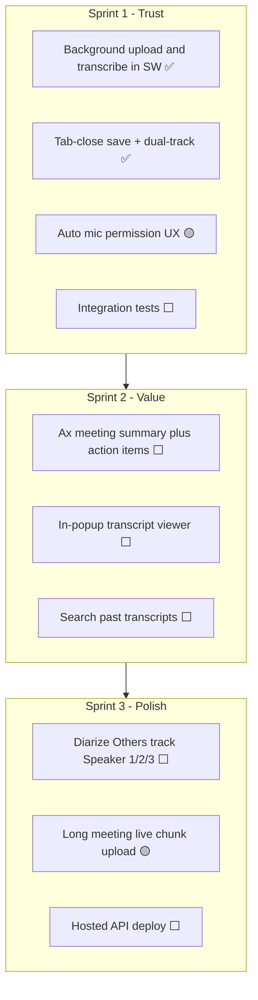

# Cognium Meet — Roadmap

You have a working core loop: record a browser tab (+ optional mic) → transcribe via Whisper → download timestamped TXT/JSON with **You** / **Others** speaker labels when mic is enabled. This document outlines practical next steps, ordered by impact.

**Legend:** ✅ Done · 🟡 Partial · ⬜ Not started

## Shipped (not originally on roadmap)

| Status | Item |
|--------|------|
| ✅ | **Record any `http`/`https` tab** (not only Google Meet) |
| ✅ | **Microphone device picker** in Settings (`deviceId` binding; Chrome ≠ OS default) |
| ✅ | **Inline Settings in popup** — API URL, token (show/hide), mic device; shared with options page |
| ✅ | **Dual-track recording** — separate tab + mic streams; transcripts labeled **You** vs **Others** |
| ✅ | **Multipart upload** (no base64 bloat) + **150 MB** API body limit; `audio` + optional `micAudio` |
| ✅ | **Whisper prep**: compress to MP3 + **chunk long audio** before transcription |
| ✅ | **Whisper cross-chunk prompting** — previous-chunk transcript as prompt (no title in prompt; avoids echo) |
| ✅ | **IndexedDB local backup** before upload (tab + mic); **Retry upload** on failure |
| ✅ | **Stop recording** without transcribe (save locally; transcribe later) |
| ✅ | **Delete local** (IndexedDB) and **Delete on server** (`DELETE /v1/recordings/:id`) |
| ✅ | **API request logging** + transcription lifecycle logs |
| ✅ | **Retry transcription** endpoint + OpenAI connection retries |
| ✅ | **Recording state** survives popup close / service worker restart |
| ✅ | **Tab-close save** — flush to IndexedDB on capture end; `OFFSCREEN_FLUSH` + race fixes |
| ~~✅~~ | ~~**Consent banner** on recorded tabs~~ — removed (recording status shown in popup only) |

---

## Tier 1 — Reliability & daily usability (do these first)

These address pain already hit during testing.

| Status | Item | Why |
|--------|------|-----|
| ✅ | **Background transcription** | Upload + poll run in the service worker; safe to close the popup while transcribing. |
| 🟡 | **Auto mic prompt on first record** | Mic grant + device picker live in **Settings**; popup warns when mic is missing. No in-popup CTA before first record yet. |
| ✅ | **Recording survives tab close** | On tab close or capture end, offscreen flushes both tracks to IndexedDB and finalizes. |
| 🟡 | **Long meeting support (>30 min)** | Multipart upload, MP3 compression, Whisper chunking, cross-chunk prompts, and higher body limit are in. No live chunked upload *during* recording yet. |
| 🟡 | **Dev ergonomics** | `pnpm dev` / `dev:api` / `dev:extension`, `/health` endpoint, README notes on stale `:3847` and inotify. No `/version` or `dev:api:restart` script yet. |
| ⬜ | **Integration tests** | API upload → ffmpeg → Whisper (mocked) + extension audio-bytes round-trip + dual-track merge tests. *(Only `packages/shared` has unit tests today.)* |

## Tier 2 — Otter/Fellow basics (biggest product jump)

| Status | Item | Why |
|--------|------|-----|
| ⬜ | **AI meeting notes** | Post-process `transcript.json` with `@ax-llm/ax`: summary, action items, decisions, open questions. |
| 🟡 | **Speaker labels** | **You / Others** via dual-track when mic is on. Still no per-participant labels on the tab mix (needs diarization or Meet caption scrape). |
| ⬜ | **In-popup transcript viewer** | Today you only download TXT/JSON. Show transcript inline with search and copy. |
| ⬜ | **Search across past meetings** | Index transcripts in SQLite or the API. |

## Tier 3 — Smarter capture

| Status | Item | Why |
|--------|------|-----|
| ⬜ | **Real-time captions** | Stream chunks to a live STT API; show captions in a sidebar or panel. |
| ✅ | **Separate mic vs tab tracks** | Shipped as dual-track recording (see above). |
| ⬜ | **Per-person labels on tab audio** | Diarize the **Others** track (`gpt-4o-transcribe-diarize`, Deepgram, or pyannote) → Speaker 1/2/3. |
| ⬜ | **Meet display names without a bot** | Scrape live captions UI or use Google Workspace recording — fragile. |
| ⬜ | **Language detection + translation** | Optional translate-to-English (or target language) in the API. |

## Tier 4 — Platform & scale

| Status | Item | Why |
|--------|------|-----|
| ⬜ | **Hosted API** | Deploy API (Fly.io, Railway, etc.) so users aren't on `localhost:3847`. |
| ⬜ | **User accounts / OAuth** | Replace bearer token with Google sign-in; per-user storage. |
| ⬜ | **Meeting bot path** | Playwright bot joins as a participant (Fireflies-style). |
| ⬜ | **Zoom / Teams** | Same pipeline, different capture per platform. |

## Suggested order (next 3 sprints)

- **Sprint 1** — Core trust work is done; finish mic-in-popup CTA + integration tests.
- **Sprint 2** — Where it starts to feel like Otter (notes + readable output in popup).
- **Sprint 3** — Multi-speaker on tab audio + production hosting.

## Quick wins (≈1 day each)

| Status | Item |
|--------|------|
| ✅ | Show full error text in history for failed / upload_failed recordings |
| ✅ | Dual-track **You** / **Others** in TXT and JSON exports |
| ⬜ | **Open transcript folder** link in popup (path to `storage/transcripts/`) |
| ⬜ | **Whisper model toggle** in API env (`whisper-1` vs `gpt-4o-mini-transcribe`) |
| ⬜ | **Recording quality indicator** — byte size / duration before upload |
| ⬜ | **Auto-restart API** — `pnpm dev:api:restart` script |
| ⬜ | **Silence trim** before Whisper — reduce hallucinations on quiet lead-in |

## Recommended starting point

**Integration tests** — lock in dual-track upload, merge, and transcript shape.

Then **in-popup transcript viewer** + **AI meeting notes (`@ax-llm/ax`)** — biggest step toward Otter/Fellow.

For multi-speaker meetings beyond You/Others: **`gpt-4o-transcribe-diarize`** on the tab (Others) track only.
