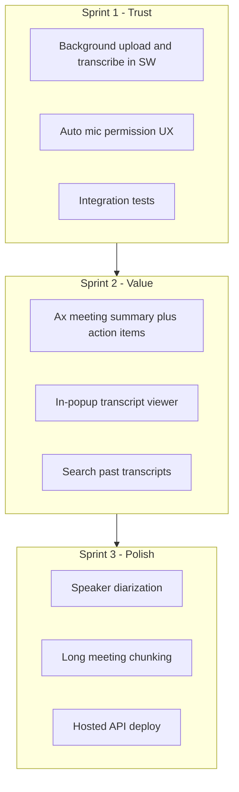

# Cognium Meet — Roadmap

You have a working core loop: record Google Meet → transcribe via Whisper → download timestamped TXT/JSON. This document outlines practical next steps, ordered by impact.

## Tier 1 — Reliability & daily usability (do these first)

These address pain already hit during testing.

| Item | Why |
|------|-----|
| **Background transcription** | Popup must stay open while Whisper runs. Move upload + poll into the service worker so closing the popup doesn't lose progress. |
| **Auto mic prompt on first record** | Many users won't open Settings first. If mic isn't granted, show a clear in-popup CTA before/during recording. |
| **Recording survives tab close** | Today, closing Meet mid-recording loses everything. Flush partial audio on `tabs.onRemoved` and offer "recover last recording". |
| **Long meeting support (>30 min)** | Chunk uploads or stream in segments; Whisper has file size limits and long WebM files can fail. |
| **Dev ergonomics** | Single `pnpm dev` script, API version endpoint, and a startup check so stale servers on `:3847` are obvious. |
| **Integration tests** | API upload → ffmpeg → Whisper (mocked) + extension audio-bytes round-trip tests so `[object Object]` / silent uploads don't regress. |

## Tier 2 — Otter/Fellow basics (biggest product jump)

| Item | Why |
|------|-----|
| **AI meeting notes** | Post-process `transcript.json` with `@ax-llm/ax`: summary, action items, decisions, open questions. This is the main Otter/Fellow gap. |
| **Speaker labels** | Whisper doesn't diarize. Add Deepgram (`diarize=true`) or pyannote so transcripts show "Speaker 1 / Speaker 2" or names. |
| **In-popup transcript viewer** | Today you only download TXT/JSON. Show the transcript inline with search and copy. |
| **SRT / VTT export** | Small addition on top of existing segments; useful for captions and sharing. |
| **Search across past meetings** | Index transcripts in SQLite or the API; search by title, date, or content. |

## Tier 3 — Smarter capture

| Item | Why |
|------|-----|
| **Real-time captions** | Stream audio chunks to Deepgram/AssemblyAI live API; show captions in a Meet sidebar or extension panel. |
| **Separate mic vs tab tracks** | Record two streams, merge for playback but transcribe separately → better diarization ("You" vs "Others"). |
| **Language detection + translation** | Whisper detects language; add optional translate-to-English (or target language) in the API. |
| **Calendar integration** | Read Google Calendar for Meet links; auto-suggest "Record this meeting?" when a call starts. |

## Tier 4 — Platform & scale

| Item | Why |
|------|-----|
| **Hosted API** | Deploy API (Fly.io, Railway, etc.) so users aren't running `localhost:3847`. |
| **User accounts / OAuth** | Replace bearer token with Google sign-in; per-user transcript storage. |
| **Meeting bot path** | Playwright bot joins as a participant (Fireflies-style) for users who don't want a Chrome extension. |
| **Zoom / Teams** | Same pipeline, different capture method per platform. |

## Suggested order (next 3 sprints)

- **Sprint 1** — Makes the tool dependable for real daily use.
- **Sprint 2** — Where it starts to feel like Otter (notes + readable output).
- **Sprint 3** — Closes the gap on multi-speaker meetings and production readiness.

## Quick wins (≈1 day each)

1. Show full error text in history for all failed recordings (partially done).
2. Add **"Open transcript folder"** link in popup (path to `storage/transcripts/`).
3. **Whisper model toggle** in API env (`whisper-1` vs `gpt-4o-mini-transcribe` for cost/quality).
4. **Recording quality indicator** — show audio byte size / duration before upload so users know capture worked.
5. **Auto-restart API** note in README + `pnpm dev:api:restart` script.

## Recommended starting point

**Background transcription + AI meeting notes** — smallest amount of work for the biggest step toward Otter/Fellow.
